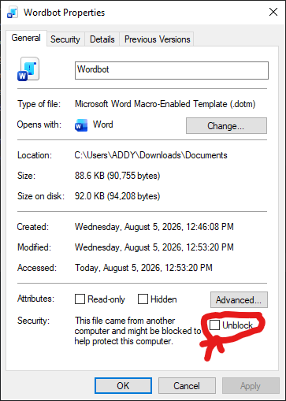

# Installation Guide - Windows

This guide covers installing Wordbot on Windows.

## Choose Your Edition

| Edition | What it does | Python Required | Zotero Required |
|---------|--------------|-----------------|-----------------|
| Markdown | Core Markdown formatting only | No | No |
| LLM | Markdown + AI model integration | Yes | No |
| Research | Markdown + AI + Zotero citations | Yes | Yes |

## Step 1: Download Pre-built Templates

The pre-built edition-wise templates are located in [Powershell/build/](../Powershell/build)
- [Wordbot_Markdown.dotm](../Powershell/build/Wordbot_Markdown.dotm) - Core Markdown formatting features
- [Wordbot_LLM.dotm](../Powershell/build/Wordbot_LLM.dotm) - Markdown + LLM integration
- [Wordbot_Research.dotm](../Powershell/build/Wordbot_Research.dotm) - Markdown + LLM + Zotero research features

## Step 2: Unblock the Template File

When you download a file from the internet, Windows may block it to protect your system. This can prevent macros from running correctly.

1. Right-click the downloaded `.dotm` file and select **Properties**.
2. At the bottom of the General tab, look for the **Security** section.
3. Check the box that says **Unblock**.
4. Click **OK**.

    

> [!IMPORTANT]
> If you skip this step, Word may not load the template or may block macros from running.

## Step 3: Set Up Python (LLM and Research Editions Only)

> [!NOTE]
> Skip this step if you are using `Wordbot_Markdown.dotm`.

Follow the instructions in [PythonGuide.md](PythonGuide.md) to set up Python and configure the LLM endpoint.

## Step 4: Set Up Zotero (Research Edition Only)

> [!NOTE]
> Skip this step if you are using `Wordbot_Markdown.dotm` or `Wordbot_LLM.dotm`.

Follow the instructions in [ZoteroGuide.md](ZoteroGuide.md) to set up Zotero and Zotseek.

## Step 5: Copy Template to Word STARTUP Folder

Copy your chosen `.dotm` file to word startup folder:

```
%AppData%\Microsoft\Word\STARTUP
```

Word will automatically load it on launch.

## Step 6: Launch Word

Open Microsoft Word. You should see a **Wordbot** tab in the ribbon.

> [!NOTE]
> If the Wordbot tab does not appear, restart Word completely. Ensure the `.dotm` file is unblocked and in the correct STARTUP folder.

---

## Next Steps

See [WordbotUserGuide.md](WordbotUserGuide.md) for features and buttons.

## Troubleshooting

If you encounter issues, see [Troubleshooting.md](Troubleshooting.md) for common problems and solutions.