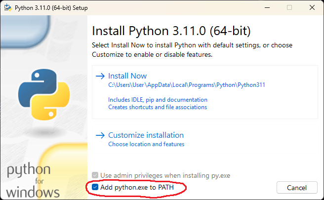

# Python Guide

This guide covers setting up the Python backend for Wordbot's LLM and Research editions.

> [!NOTE]
> This guide is only required if you are using `Wordbot_LLM.dotm` or `Wordbot_Research.dotm`. The Markdown edition does not require Python.

## Overview

Wordbot uses a Python server (`main.py`) to handle:
- LLM communication (chat, summarize, translate, expand)
- Zotero research queries (semantic search and citation generation)
- Processing and formatting responses

The server runs locally on your machine and communicates with Word via HTTP requests.

## Prerequisites

- Python 3.7 or later (tested with 3.11)
- Internet connection for downloading dependencies

## Step 1: Download the Python Files

The Python server files are part of the Wordbot repository. You can get them in one of two ways:

### Option A: Download the Full Repository (Recommended)

1. Go to https://github.com/Addy-ad/wordbot
2. Click the **"<> Code"** button and select **"Download ZIP"**
3. Extract the ZIP file
4. The `Python` folder will be inside the extracted `wordbot-main` folder

### Option B: Clone with Git

```bash
git clone https://github.com/Addy-ad/wordbot.git
```

The Python server files will be in `wordbot/Python/`.

> [!NOTE]
> The **"<> Code"** button is only available at the root of the repository. You must download the entire repository and then use the `Python` folder from it.

## Step 2: Install Python

If you don't have Python installed:

1. Download Python 3.11 from https://www.python.org/downloads/release/python-3110/
2. Run the installer
3. **During installation, check "Add python.exe to PATH"**
4. Complete the installation

    

Verify Python is installed:

```bash
python --version
```

## Step 3: Create and Activate Virtual Environment

Navigate to the `Python` folder and create a virtual environment:

```bash
cd path/to/wordbot/Python
python -m venv venv
```

Activate the virtual environment:

**Windows:**
```bash
venv\Scripts\activate
```

**macOS:**
```bash
source venv/bin/activate
```

After activation, you should see `(venv)` at the beginning of your command prompt.

> [!TIP]
> Note down the full path to the Python executable inside the virtual environment. You will need this later when configuring the VBA template.

| OS | Path |
|----|------|
| Windows | `C:\Users\YourName\wordbot\Python\venv\Scripts\python.exe` |
| macOS | `/Users/YourName/wordbot/Python/venv/bin/python` |

Replace `YourName` and the folder path with your actual location.

## Step 4: Install Dependencies

With the virtual environment activated, navigate to the Python folder that you downloaded from repository and install dependencies:

```bash
cd "C:\Users\YourName\Downloads\wordbot-main\Python"
pip install -r requirements.txt
```

This installs:
- Flask (web server)
- requests (HTTP client)
- openai (LLM API client)
- waitress (production server)
- beautifulsoup4 (HTML parsing)

> [!NOTE]
> `requirements.txt` is located in the same folder as `main.py`.

## Step 5: Configure LLM Endpoint

Wordbot connects to an LLM server via an OpenAI-compatible API endpoint. Installing and hosting an LLM server is outside the scope of this guide. If you are new, check how to install [LM Studio](https://lmstudio.ai/) and how to download a model and start a server.

Open `main.py` in the `Python/` folder and update the configuration at the top:

```python
# --- CONFIG AT THE BEGINNING ---
LLM_URL = "http://localhost:8080/v1"  # Your LLM endpoint
MODEL_NAME = "your-model-name"         # Model identifier
API_KEY = "XXXX"                       # Your API key
```

**Example configurations:**

| LLM Server | LLM_URL | Notes |
|------------|---------|-------|
| LM Studio | `http://localhost:1234/v1` | Default port 1234 |
| llama.cpp | `http://localhost:8080/v1` | Default port 8080 |
| Ollama | `http://localhost:11434/v1` | Default port 11434 |
| vLLM | `http://localhost:8000/v1` | Default port 8000 |

> [!CAUTION]
> **Thinking Mode:** If your model supports active thinking or reasoning chains, ensure thinking mode is **disabled** in your LLM server settings. Active thinking can cause response parsing delays or get stuck in an infinite loop. Stopping a runaway generation requires restarting the LLM server.

## Step 6: Test the Server

Start the Python server:

```bash
cd "C:\Users\YourName\Downloads\wordbot-main\Python"
python main.py
```

You should see in the console output similar to:

```
Wordbot Python Server Initializing with endpoints...
--------------------------------------------------
LLM Endpoint:            http://127.0.0.1:3670/process
Research Endpoint:       http://127.0.0.1:3670/research
--------------------------------------------------
LLM Server:              http://localhost:8080/v1
Selected LLM Model:      Gemma4-E2B-Uncensored-IVA
Ready to receive requests from MS Word.
INFO:waitress:Serving on http://127.0.0.1:3670
```

> [!TIP]
> You can also start the server from the Wordbot ribbon by clicking the **Start Server** button after the template is installed.

## Step 7: Note Down Paths for VBA Configuration

After completing the Python setup, note down these two paths. You will need them when configuring the VBA template.

| Path | Description | Example |
|------|-------------|---------|
| `{{PYTHON_EXE_PATH}}` | Full path to Python executable inside virtual environment | `C:\Users\YourName\wordbot\Python\venv\Scripts\python.exe` |
| `{{PYTHON_SERVER_PATH}}` | Full path to `main.py` | `C:\Users\YourName\Downloads\wordbot-main\Python\main.py` |

## Step 8: Update Paths in the VBA Template

After noting down the paths above, you need to update them inside the Word template (`Wordbot_LLM.dotm` or `Wordbot_Research.dotm`).

1. Open Microsoft Word.
2. Go to **File > Open** and navigate to the location where you downloaded the template.
3. Select the template file (`Wordbot_LLM.dotm` or `Wordbot_Research.dotm`) and open it.
4. Press `Alt + F11` (Windows) or `Option + F11` (macOS) to open the VBA Editor.
5. In the **Project Explorer** window (left pane), ensure the correct project is selected. Look for the projects:
   - `Wordbot_LLM_Project` (for LLM edition) or
   - `Wordbot_Researc_hProject` (for Research edition)
6. Expand the project, navigate to **Modules**, and double-click `aWordbotRibbonLLMFunctions`.
7. Locate the `Ribbon_StartServer` subroutine and replace the placeholders with your actual paths from Step 7:

```vba
pythonPath = "{{PYTHON_EXE_PATH}}"
scriptPath = "{{PYTHON_SERVER_PATH}}"
```

For example:

```vba
pythonPath = "C:\Users\YourName\wordbot\Python\venv\Scripts\python.exe"
scriptPath = "C:\Users\YourName\Downloads\wordbot-main\Python\main.py"
```

8. Press `Ctrl + S` (Windows) or `Cmd + S` (macOS) to save.
9. Close the VBA Editor and close Word.

> [!NOTE]
> This step is also covered in the installation guides for [Windows](InstallationWindows.md#step-5-configure-python-paths-in-the-template) and [macOS](InstallationMacOS.md#step-6-configure-python-paths-in-the-template).

## Troubleshooting

### Python Not Found

```
'python' is not recognized as an internal or external command
```

**Solution:** Python is not in your PATH. Reinstall Python and check "Add python.exe to PATH".

### pip Install Fails

```
Could not find a version that satisfies the requirement
```

**Solution:** Ensure you have activated the virtual environment and have an internet connection.

### Server Won't Start

```
Address already in use
```

**Solution:** Another process is using port 3670. Close the other process or change the port in `main.py`.

### LLM Connection Fails

```
Connection refused
```

**Solution:** Ensure your LLM server is running and the `LLM_URL` in `main.py` matches the server endpoint.