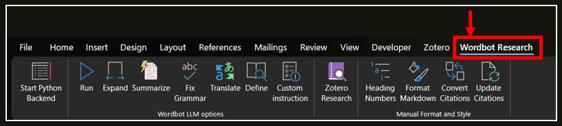
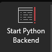
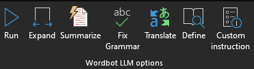
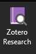
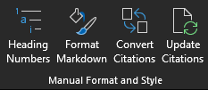
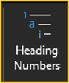
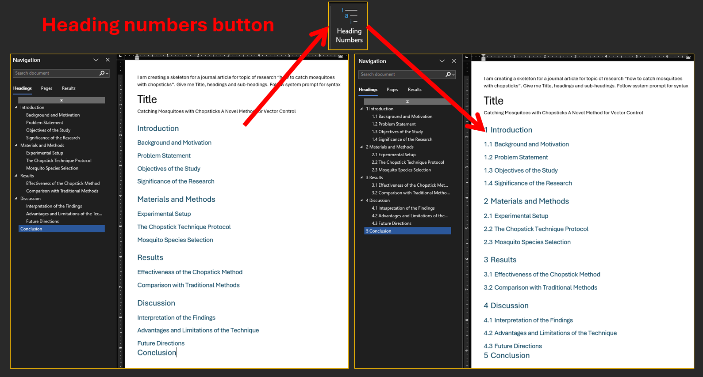
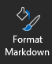

# Wordbot User Guide

This guide explains the features, buttons, and workflow of Wordbot once installed.

## Overview

Wordbot adds a custom ribbon to Microsoft Word with buttons for formatting Markdown, communicating with LLMs, and performing research using your Zotero library. All processing happens locally on your machine.

This is an example of the ribbon with Wordbot Research edition:


Some Wordbot buttons have keyboard shortcuts. You can press the listed key combination instead of clicking the button. The shortcuts differ based on your operating system.

> [!NOTE]
> macOS shortcuts are implemented but not tested. In case the shortcuts are not working. Please just press the buttons directly :D

| Button | Windows Shortcut | macOS Shortcut | Function |
|--------|------------------|----------------|----------|
| Start Python Backend | - | - | Launch the Python server |
| Run | `Alt + R` | `Ctrl + Option + R` | Send selected text to LLM for processing |
| Expand | `Alt + E` | `Ctrl + Option + E` | Expand or elaborate on the selected text |
| Summarize | `Alt + S` | `Ctrl + Option + S` | Summarize the selected text |
| Fix Grammar | `Alt + F` | `Ctrl + Option + F` | Fix grammar and spelling errors |
| Translate | `Alt + T` | `Ctrl + Option + T` | Translate selected text to English |
| Define | `Alt + D` | `Ctrl + Option + D` | Define or explain the selected word or phrase |
| Custom Instruction | `Alt + C` | `Ctrl + Option + C` | Run a custom prompt on the selected text |
| Zotero Research | `Alt + Z` | `Ctrl + Option + Z` | Semantic search across Zotero library with citations |
| Heading Numbers | - | - | Apply multilevel numbering to document headings |
| Format Markdown | - | - | Convert Markdown to native Word elements |
| Convert Citations | - | - | Convert unprocessed citations to Word format |
| Update Citations | - | - | Refresh and update citation numbers |

> [!TIP]
> These shortcuts are active as soon as Wordbot is loaded. No additional setup is required.

> [!NOTE]
> The shortcuts shown are specific to your operating system. The ribbon will display the correct shortcut for your platform in the tooltip when you hover over a button.

## Wordbot Ribbon

After installing the template, you will see a **Wordbot** tab in the Word ribbon. The ribbon is organized into four sections:

1. **Python Backend** - Start the Python server
2. **LLM Buttons** - Communicate with AI models
3. **Research** - Zotero-powered research
4. **Manual Tools** - Formatting and utility buttons

---

## Start Python Server



This button launches the Python backend by running `main.py`. It must be clicked before using any LLM or Research features.

> [!IMPORTANT]
> While this button handles the Python backend, you need to start your local LLM server (e.g., llama.cpp, Ollama, LM Studio) manually according to your setup.

---

## LLM Buttons



These buttons enable direct communication with your LLM model. Responses are generated based on the model's training data.

> [!CAUTION]
> The LLM may produce hallucinations or inaccurate information when it lacks sufficient knowledge on a topic. Always verify important information.

---

## Zotero Research Button



The Zotero Research button performs semantic searches across your local Zotero library and generates grounded content with inline citations.

**Keyboard Shortcut:** `Alt + Z`

### Step-by-Step Process

1. **Provide Context**: Type some text or select an existing paragraph to serve as context for your research.

2. **Generate Search Queries**: The local LLM analyzes your context and generates 3-4 targeted search queries.

3. **Semantic Search**: For each query, Zotseek performs semantic searches through your Zotero library to find relevant content. The zotseek settings are hardcoded to the following (Check `aWordbot_Research.bas` VBA macro module if you want to change the settings):

```vba
topK = "4"
mode = "hybrid"
minSimilarity = "0.3"
```

4. **Smart Grouping**: The top results from each query are retrieved. If multiple results come from the same source, they are grouped together to ensure each article receives a single citation number and duplicates are ignored.

5. **Content Generation**: The grouped context is packed as JSON and processed by the LLM to produce knowledge-backed content with inline citations.

6. **Citation Formatting**: Inline citations are automatically converted to Zotero standards, allowing Zotero to manage the citation and bibliography workflow.

### Important Notes

- **Bibliography Generation**: The bibliography is not generated automatically. Use Zotero's "Add/Edit Bibliography" button to insert citations.

- **Manual Citations**: If you need to add citations manually, use the "Add/Edit Citation" button in the Zotero plugin.

- **Automatic Updates**: Once citations are added, Zotero will automatically update all citations and the bibliography (if already present).

---

## Manual Buttons



### Heading Numbers



Click once to automatically number all headings in your document. New headings will automatically follow the numbering sequence. This setting persists after saving. You only need to click this button once per document. The heading numbering will remain active even after you close and reopen the document.



### Format Markdown



Converts Markdown-formatted text into native Word elements including:
- Tables
- Headers (H1–H6)
- Code blocks
- Bulleted lists
- LaTeX equations

**When to use**: Sometimes Markdown formatting may not be complete at the end of the selected text. Select the remaining text and click **Format Markdown** again.

### Convert Citations

Converts inline citations from Wordbot format to Zotero format. Use this if citations were not converted during the Zotero Research process.

### Update Citations

Calls Zotero's refresh backend VBA macro to update citations.

> [!NOTE]
> On macOS, you may see a message box instructing you to click the refresh button directly in Zotero. This is because macOS cannot call macros from another project.

---

## Workflow Example

### Using LLM

1. Select text in your document
2. Click **Start Server** (if not already running)
3. Press `Alt + R` (or click **Run**)
4. Wait for response to appear
5. If not satisfied, press `Ctrl + Z` and try again

### Using Research

1. Select text providing context for your research
2. Click **Start Server** (if not already running)
3. Press `Alt + Z` (or click **Zotero Research**)
4. Wait for semantic search and content generation
5. Review generated content with inline citations
6. Use Zotero to add bibliography

---

## Tips and Best Practices

### General

- Save your document before running any operations
- Keep the Python server running for faster response times
- Use `Ctrl + Z` to easily revert LLM responses

### LLM

- Be specific in your prompts for better results
- Use **Custom** for advanced prompts.
- If a response gets stuck, restart the LLM server

### Research

- Ensure your Zotero library is indexed (see ZoteroGuide.md)
- More context text usually yields better search results
- Check citations against your Zotero style settings

### Markdown

- Use **Format Markdown** on complete Markdown blocks
- If formatting is incomplete, select remaining text and run again
- Tables and code blocks work best with clean Markdown input

---

## Known Limitations

- **One-way communication**: VBA → Python server only. Cannot interrupt generation mid-response.
- **Stop/kill**: Kill the LLM server process to stop a long-running response.
- **Markdown formatting**:
  - Works most of the time but may occasionally loop infinitely
  - Multi-level lists may not work as intended
  - Formats inside tables won't work
  - Formatting glitches may appear occasionally