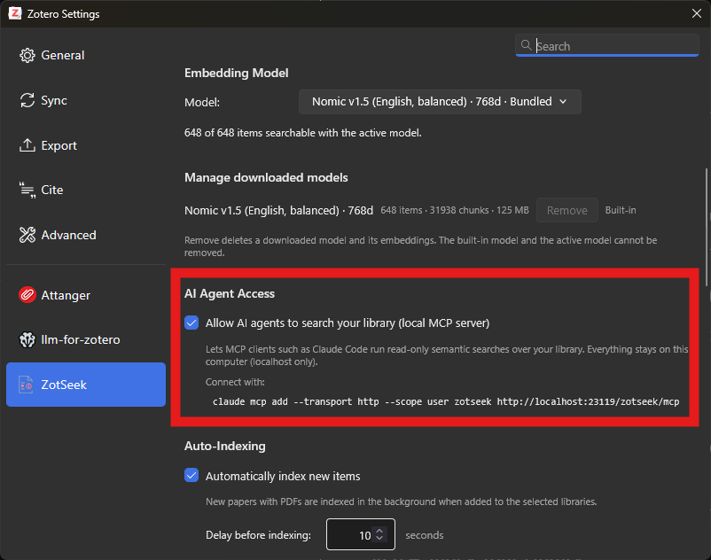

# Zotero Guide

This guide covers setting up Zotero and Zotseek for Wordbot's Research edition.

> [!NOTE]
> This guide is only required if you are using `Wordbot_Research.dotm`. The Markdown and LLM editions do not require Zotero.

## Overview

Wordbot uses Zotero and the Zotseek plugin to enable Retrieval-Augmented Generation (RAG) across your personal paper collection. All processing happens locally on your machine. Your library data never leaves your computer.

When you use the **Zotero Research** button, Wordbot:

1. Generates semantic search queries based on your selected text
2. Searches your local Zotero library using Zotseek
3. Groups results by source article
4. Generates structured content with inline citations
5. Formats the citations to match your active Zotero style
6. Create the bibliography with zotero with your preferred style.

## Prerequisites

- Zotero 8.0 or later (tested with 9.0.2). [Link to download Zotero](https://www.zotero.org/download/)
- Zotseek 1.18.0 or later (compatible with Zotero 8 & 9). [Link to Zotseek Github](https://github.com/introfini/ZotSeek)
- Your Zotero library must be stored locally (not just cloud-only). Semantic search requires local access to your paper files for indexing.

> [!IMPORTANT]
> Wordbot works with your **local Zotero library**. This means:
> - Your papers are indexed on your machine
> - All searches happen offline
> - Your library data never leaves your computer
> - Cloud sync is fine as long as your library is also stored locally

## Step 1: Install Zotero

If you don't have Zotero installed:

1. Download Zotero from [zotero.org](https://www.zotero.org/download/)
2. Install and set up your library
3. Ensure your library is stored locally (default installation stores files in your user directory)

> [!TIP]
> Wordbot has been tested with **Zotero 9.0.2**. Earlier versions may work but are not officially tested. 

## Step 2: Install Zotseek Plugin

Zotseek adds semantic search capabilities to Zotero.

1. Download the latest Zotseek release from https://github.com/introfini/ZotSeek/releases
2. In Zotero, go to **Tools → Add-ons**
3. Click the gear icon and select **Install Add-on From File**
4. Select the downloaded `.xpi` file
5. Restart Zotero

Verify Zotseek is installed by checking for a **ZotSeek** tab or section in Zotero's settings.

> [!NOTE]
> Check ZotSeek compatibility with zotero version from Zotseek's repository.

## Step 3: Enable Local MCP Server (Critical)

This is the most important step. Wordbot communicates with Zotero through Zotseek's local API, which is **disabled by default**.

1. Open Zotero
2. Go to **Settings** (or **Preferences** on macOS)
3. Navigate to the **ZotSeek** tab
4. Find the **AI Agent Access** section
5. Check **"Allow AI agents to search your library (local MCP server)"**

    

> [!CAUTION]
> If this setting is not enabled, the Zotero Research button will not work. Wordbot will not be able to query your library.

## Step 4: Index Your Library

For semantic search to work, your papers must be indexed. This allows Zotseek to understand the content of your documents.

1. In Zotero, go to the **ZotSeek** tab in Settings
2. Click **"Index Library"** or **"Rebuild Index"**
3. Wait for indexing to complete

**Indexing time depends on your library size:**
- Small library (< 100 papers): 5-10 minutes
- Medium library (100-500 papers): 30-60 minutes
- Large library (500+ papers): Several hours

> [!TIP]
> For large collections (600+ papers), let indexing run overnight. You can continue using Zotero while it indexes in the background.

## Step 5: Verify Setup

To confirm everything is working:

1. Ensure the Zotseek MCP server is enabled
2. In Zotero, go to the **ZotSeek** tab
3. Look for the local API endpoint URL (usually `http://localhost:3670` or similar)
4. Wordbot will connect to this endpoint automatically

If you see a local URL and indexing has completed, your Zotero setup is ready.

## How Wordbot Uses Zotero

1. **Context Selection**: You select text in Word and click **Zotero Research**
2. **Query Generation**: The LLM generates 3-4 semantic search queries based on your selection
3. **Semantic Search**: Zotseek searches your indexed library and returns relevant results
4. **Smart Grouping**: Multiple results from the same source are grouped together
5. **Content Generation**: The LLM generates structured content with inline citations
6. **Citation Formatting**: Citations are formatted to match your active Zotero style

## Troubleshooting

### Zotseek Tab Not Visible in Zotero Settings

- Verify Zotseek is installed (Tools → Add-ons)
- Restart Zotero
- Check that you have Zotero 8.0 or later

### MCP Server Option Not Available

- Update Zotseek to the latest version
- Check the ZotSeek settings thoroughly - the option may be in a sub-menu

### Wordbot Can't Connect to Zotero

- Ensure Zotero is running
- Verify the MCP server option is enabled
- Check if any firewall is blocking the connection
- Try restarting Zotero and Word

### Search Returns No Results

- Ensure your library has been indexed
- Try rebuilding the index
- Add more papers to your library
- Check that papers have full text content (not just metadata)

### Citations Not Formatting Correctly

- Ensure your Zotero style is set correctly in Zotero
- Check that the citations match Zotero's citation format
- Try using Zotero's "Add/Edit Citation" button to verify the style works

### Bibliography Not Generating

- Wordbot does not auto-generate bibliographies
- Use Zotero's "Add/Edit Bibliography" button to insert the bibliography
- Once inserted, Zotero will automatically update citations and bibliography

## References

- [Zotero Documentation](https://www.zotero.org/support/)
- [Zotseek Repository](https://github.com/introfini/ZotSeek)
- [Retrieval-Augmented Generation (RAG)](https://en.wikipedia.org/wiki/Retrieval-augmented_generation)