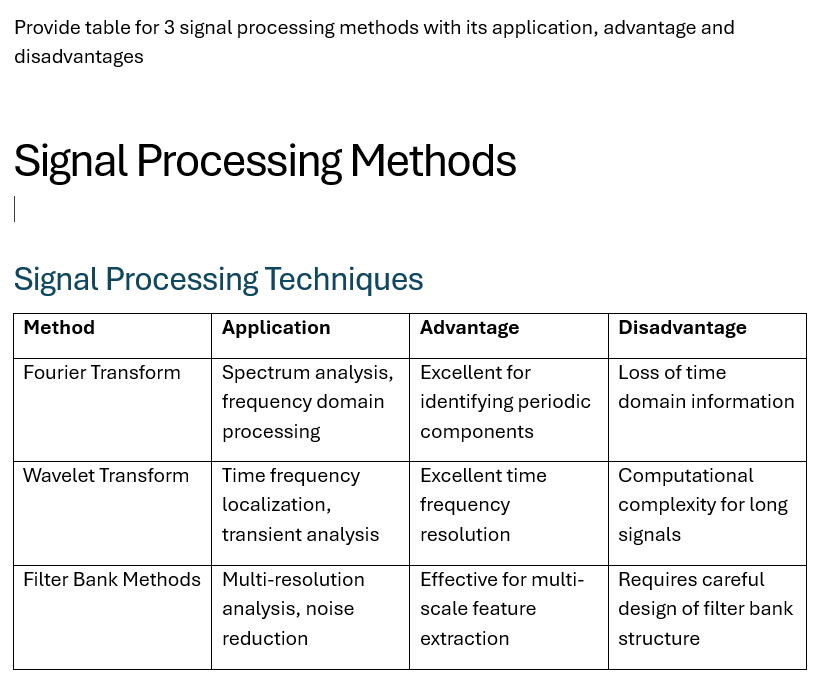
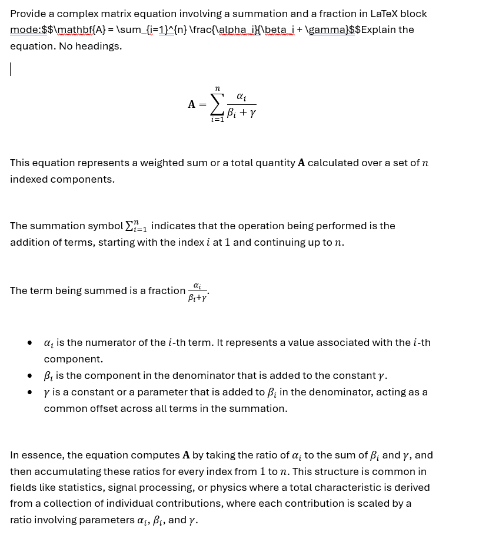
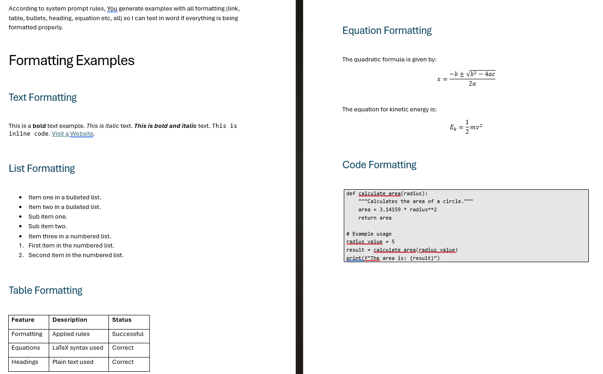
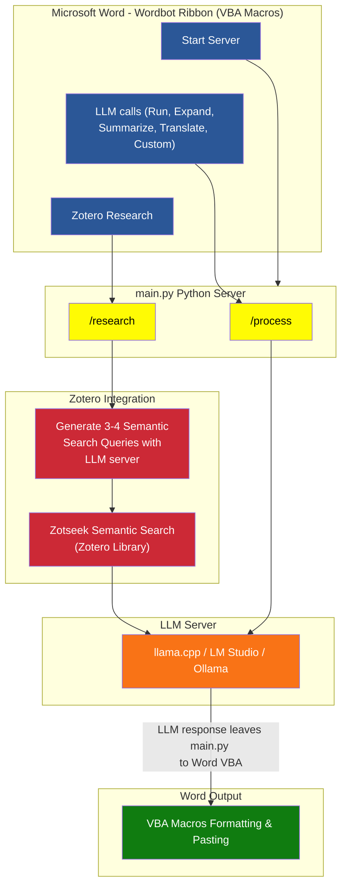

# Wordbot

> [!CAUTION]
> **Save your document before testing!** Wordbot is in active development. To prevent accidental data loss during heavy Markdown formatting operations, please save your work (`Ctrl + S` / `Cmd + S`) before running the tool.

Wordbot: The Word plugin that formats Markdown, talks to AI, and searches your research library. Built for writers, developers, and researchers. All offline. All private.

---

## Quick Start

> [!TIP]
> Choose your operating system and follow the instructions.

| Your OS | Installation Guide |
|---------|-------------------|
| Windows | [InstallationWindows.md](Docs/InstallationWindows.md) |
| macOS | [InstallationMacOS.md](Docs/InstallationMacOS.md) |

> [!NOTE]
> **For Developers and Advanced Users (Windows Only):**
> If you want to build templates from source, modify VBA macros using an external IDE like VS Code, or automatically build all three editions at once, see the [DeveloperGuide.md](Docs/DeveloperGuide.md). This workflow allows you to:
> - Edit VBA source files in VS Code
> - Live update macros in Word without restarting (`docLiveUpdateMacros.ps1`)
> - Build and install templates programmatically (`installWordBotTemplate.ps1`)
> - Build all editions in one command (`BuildAllEditions.ps1`)

### Editions

| Edition | What it does | OS Support | Prerequisites | Python Required | Zotero Required |
|---------|--------------|------------|---------------|-----------------|-----------------|
| **Markdown** | Core Markdown formatting only | Windows, macOS | Microsoft Word | No | No |
| **LLM** | Markdown + AI model integration | Windows, macOS | Microsoft Word, Python 3.7+, LLM Server (LM Studio/Ollama/llama.cpp) | Yes | No |
| **Research** | Markdown + AI + Zotero citations | Windows, macOS | Microsoft Word, Python 3.7+, LLM Server, Zotero 8.0+, Zotseek plugin | Yes | Yes |

> [!TIP]
> If you only need basic Markdown formatting, the Markdown edition is sufficient. Choose LLM if you want to use AI models. Choose Research if you need Zotero integration for academic citations.

---

## Why I Built This

As a researcher, a huge chunk of my actual work isn't writing—it's fighting with Microsoft Word formatting.

Like most people, I rely heavily on AI tools to draft, brainstorm, and rephrase. But the workflow always felt fundamentally broken: prompt an LLM in a browser, copy the response, paste it into Word, and waste time manually rebuilding tables, converting formulas into Word equations, fixing broken headers, and styling code blocks. Doing this dozens of times during a single paper drains focus and wastes hours on repetitive chores that add zero intellectual value.

I built **Wordbot** to solve my own frustration and eliminate that friction entirely.

It started as a set of VBA macros designed to parse incoming Markdown and render it directly into native, perfectly styled Word elements. Once the formatting engine was solid, I built a local Python server to bridge Word to LLMs, allowing me to trigger prompts directly on selected text without leaving the document.

However, smaller local models running on a laptop often lack domain knowledge and produce generic responses or hallucinations. To solve this, I hooked the backend into my local Zotero library via Zotseek. Wordbot now performs semantic searches across my personal paper collection, extracts grounding facts, and writes context-aware text complete with Zotero-aligned inline citations. Because these match Zotero's exact citation structure, the native Zotero Word plugin treats them as its own, allowing me to manually insert additional citations and generate a unified bibliography effortlessly.

Wordbot is an evolving project. Future updates will focus on deeper autonomous research workflows and broader retrieval capabilities right inside Word.

---

## Features

- **Automatic Markdown-to-Word Formatting:** Instantly converts AI outputs into native Word tables, styled headers (H1–H6), code blocks, bulleted lists, and LaTeX equations. Format existing Markdown text on demand with a single click.

- **Seamless In-Document LLM Communication:** Prompt any model directly inside Word. Highlight text and click **Run** (or use keyboard shortcuts) to generate, summarize, expand, or translate text. If an output isn't quite right, `Ctrl+Z` / `Cmd+Z` cleanly reverts the changes.

- **Grounded Academic Research via Zotero:** Ask questions directly against your reference library using [Zotseek](https://github.com/introfini/ZotSeek). Wordbot performs semantic searches, extracts key findings, and generates grounded text with matching inline citations.

- **Zotero Bibliography Integration:** Inline citations adhere strictly to your active Zotero citation style (APA, IEEE, Harvard, etc.). The official Zotero plugin handles bibliography generation seamlessly.

---

## Demo Video

*3.5x speed due to file size restriction. Every time I press Run, I ask a local AI model with no Zotero library context, so it gives generic responses. For the last query, I do semantic search on Zotero library and it brings up context with inline citations.*

https://github.com/user-attachments/assets/7c6b6159-4123-4f16-9c4d-8c9638e9a323

---

## Examples

| Example | Description |
|---------|-------------|
|  | Zotero research result with inline citations and bibliography (IEEE style) |
|  | Block and inline LaTeX equations |
|  | Overall formatting capabilities |

> [!TIP]
> Try it yourself! Copy the content from [ExampleContentMarkdown.md](Extras/ExampleContentMarkdown.md) into Word and click **Format Markdown**. See also [Test prompts.txt](Extras/TestPrompts.txt) to get familiar with the kinds of requests you can make with your LLM.

---

## Documentation

| Guide | Description |
|-------|-------------|
| [InstallationWindows.md](Docs/InstallationWindows.md) | Windows installation guide |
| [InstallationMacOS.md](Docs/InstallationMacOS.md) | macOS installation guide |
| [PythonGuide.md](Docs/PythonGuide.md) | Python, venv, and LLM configuration |
| [ZoteroGuide.md](Docs/ZoteroGuide.md) | Zotero and Zotseek setup for Research edition |
| [WordbotUserGuide.md](Docs/WordbotUserGuide.md) | Features, buttons, and keyboard shortcuts |
| [DeveloperGuide.md](Docs/DeveloperGuide.md) | PowerShell toolchain for building from source (Windows only) |

---

## Flowchart

---

## Known Limitations

- **One-way communication:** VBA → Python server only. Cannot interrupt generation mid-response.
- **Stop/kill:** Kill the LLM server process to stop a long-running response.
- **Model compatibility:** Tested with Gemma4-E2B (thinking mode OFF) and Qwen2.5-32B-Instruct.
- **macOS compatibility:** Tested on macOS 26.5.2 with Mac 365.
- **Markdown formatting:**
  - Works most of the time but may occasionally loop infinitely. Force close Word to recover.
  - Multi-level lists may not work as intended.
  - Formats inside tables won't work.
  - Formatting glitches may appear occasionally (e.g., `**`).

---

## License

CC BY-NC 4.0

You are free to:
* Share — copy and redistribute the material in any medium or format
* Adapt — remix, transform, and build upon the material

The licensor cannot revoke these freedoms as long as you follow the license terms.

Under the following terms:
* Attribution — You must give appropriate credit, provide a link to the license, and indicate if changes were made. You may do so in any reasonable manner, but not in any way that suggests the licensor endorses you or your use.
* NonCommercial — You may not use the material for commercial purposes.
* No additional restrictions — You may not apply legal terms or technological measures that legally restrict others from doing anything the license permits.

Notices:
You do not have to comply with the license for elements of the material in the public domain or where your use is permitted by an applicable exception or limitation.

No warranties are given. The license may not give you all of the permissions necessary for your intended use. For example, other rights such as publicity, privacy, or moral rights may limit how you use the material.

---

## Support

- **Documentation:** See the [Docs/](Docs/) folder
- **Issues:** Please open an issue on GitHub
- **Contributions:** Pull requests welcome

---
