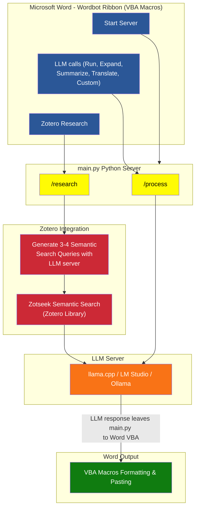

> [!CAUTION]
> **Save your document before testing!** Wordbot is in active development and intended for testing rather than production environments. To prevent accidental data loss during heavy Markdown formatting operations, please save your work (`Ctrl + S`) before running the tool.

# A short story on Why I Built this:

As a researcher, a huge chunk of my actual work isn't writing, it's fighting with Microsoft Word formatting.

Like most people, I rely heavily on AI tools to draft, brainstorm, and rephrase. But the workflow always felt fundamentally broken: prompt an LLM in a browser, copy the response, paste it into Word, and waste time manually rebuilding tables, converting formulas into Word equations, fixing broken headers, and styling code blocks. Doing this dozens of times during a single paper drains focus and wastes hours on repetitive chores that add zero intellectual value.

I built **Wordbot** to solve my own frustration and eliminate that friction entirely.

It started as a set of VBA macros designed to parse incoming Markdown and render it directly into native, perfectly styled Word elements. Once the formatting engine was solid, I built a local Python server to bridge Word to LLMs allowing me to trigger prompts directly on selected text without leaving the document.

However, smaller local models running on a laptop often lack domain knowledge and produce generic responses or hallucinations. To solve this, I hooked the backend into my local Zotero library via Zotseek. Wordbot now performs semantic searches across my personal paper collection, extracts grounding facts, and writes context-aware text complete with Zotero-aligned inline citations. Because these match Zotero's exact citation structure, the native Zotero Word plugin treats them as its own allowing me to manually insert additional citations and generate a unified bibliography effortlessly. 

Wordbot is an evolving project. Future updates will focus on deeper autonomous research workflows and broader retrieval capabilities right inside Word. 

## How one use Wordbot

> [!TIP]
> Check [this section](#explanation-for-the-flowchart-and-buttons) for explanation of the buttons and what it does in the background. 


* **Automatic Markdown-to-Word Formatting:** Instantly converts AI outputs into native Word tables, styled headers (H1–H6), code blocks, bulleted lists, and LaTeX equations. You can format existing Markdown text on demand with a single click, or let Wordbot automatically format incoming LLM responses on the fly. You can test out the feature by jumping to the [Try Markdown conversion yourself](#try-markdown-conversion-yourself) section below.
* **Seamless In-Document LLM Communication:** Prompt any model directly inside Word. Highlight text like *"I am exploring Fourier transforms..."* and click **Run** (or use quick shortcuts) to generate, summarize, expand, or translate text based on your selection. If an output isn't quite right, a simple `Ctrl+Z` cleanly reverts the changes.
* **Grounded Academic Research via Zotero (using [Zoteek plugin](https://github.com/introfini/ZotSeek)):** Ask questions directly against your reference library such as *"Summarize signal processing methods across my papers and put them in a table"*. Wordbot uses [Zoteek](https://github.com/introfini/ZotSeek) to semantically search your local library, extract key findings, and generate grounded text with matching inline citations. Also easy to revert changes using `Ctrl+Z`.
* **Native Bibliography Integration:** Inline citations generated by Wordbot adhere strictly to your active Zotero citation style (e.g., APA, IEEE, Harvard). This allows you to mix Wordbot-generated citations with manual Zotero insertions and update your unified bibliography natively using the official Zotero plugin.

## Examples using Wordbot 
Example of zotero-research result with inline citations and bibliography IEEE style:


Example table creation


Example block and inline equations


Example of overall formatting capabilities


## Try Markdown conversion yourself

I have added `ExampleContentMarkdown.md` so you can compare how Markdown formats on GitHub versus how it looks in Word after pasting the content and clicking the **Format Markdown** button.

Additionally, I have some provided some test prompts ([Test prompts.txt](Extras\TestPrompts.txt)). So, when you open word, You can run these test prompts to your local LLM and you cna get familiar what kind of requests you can make

## Flowchart



## Explanation for the flowchart and buttons

### Start python server


Let's say this button is a fancy way to launch the Python backend by running `main.py`. For detailed setup instructions, refer to the [Python Ribbon Button Configuration](#python-ribbon-button-configuration) section to ensure the button works correctly when pressed.

**Important Note:** While this button handles the Python backend, you'll need to start your local LLM server (such as llama.cpp, Ollama, or LM Studio) manually according to your preferred setup and convenience.

### LLM Buttons


These Wordbot LLM buttons enable direct communication with your LLM model. The responses are generated based solely on the model's training data. Please be aware that the LLM may produce hallucinations or inaccurate information when it lacks sufficient knowledge on a topic. The responses are purely based on the model you select. Check [LLM Configuration & Setup](#llm-configuration--setup) section on how to configure the API to communicate with your model so these buttons would work.

### Zotero Research Button


The Zotero Research button is the only feature that follows the research route. Here's how it works:

**Step-by-Step Process:**

1. **Provide Context** - Type some text or select an existing paragraph to serve as context for your research.

2. **Generate Search Queries** - The local LLM analyzes your context and generates 3-4 targeted search queries.

3. **Semantic Search** - For each query, ZotSeek performs semantic searches through your Zotero library to find relevant content.

4. **Smart Grouping** - The top results from each query are retrieved. If multiple results come from the same source, they are grouped together to ensure each article receives a single citation number.

5. **Content Generation** - The grouped context is processed by the LLM to produce structured, coherent content.

6. **Citation Formatting** - Inline citations are automatically converted to Zotero standards, allowing Zotero to manage the citation and bibliography workflow.

**Important Notes:**

- **Bibliography Generation** - The bibliography is not generated automatically. You can use Zotero's "Add/Edit Bibliography" button to insert citations.

- **Manual Citations** - If you need to add citations manually, use the "Add/Edit Citation" button in the Zotero plugin.

- **Automatic Updates** - Once citations are added, Zotero will automatically update all citations and the bibliography (if already present).

### Manual buttons


Example of **Heading numbers** button. I made it manual button since you need to click only once. The new headings would automatically follow the numberings. After adding numbers, just modify the style for each heading to your requirements.


 

(Are same as what was provied in [Examples using Wordbot](#examples-using-wordbot) section)

**Format Markdown and Convert Citations**

- **Format Markdown Button** - Sometimes the markdown formatting may not be complete at the end of the selected text. This occurs because ranges change depending on the content, leaving some text at the end unformatted. To fix this, simply select the remaining text and click the Format Markdown button.

- **Convert Citations Button** - Due to the same range-changing issue, citations may not be converted when using the Zotero Research route. To resolve this, select the text containing the citations and click the Convert Citations button.

**Update Citations Button** - This button calls Zotero's Refresh backend VBA macro from Zotero's project. Gemini said macOS users will not be able call a macro from another project. So, for macOS users, a message box will appear instructing them to click the refresh button directly in Zotero.


---

## Installation & Configuration

Wordbot was developed and tested using the following software versions and configurations. Choose the installation path that best fits your workflow:

### Path A: Standard Installation (Windows & macOS)

For regular use, simply download the pre-compiled Wordbot template `Wordbot.dotm` under ([Powershell\build\Wordbot.dotm](Powershell\build\Wordbot.dotm)). No PowerShell scripts or Word security modifications are required.

* **Microsoft Word:** Compatible with Word on Windows (Office 2016 and Office 365) and macOS.
  * Simply place `Wordbot.dotm` into Word's `STARTUP` folder so it loads automatically on launch:
    * **Windows:**
      ```cmd
      %AppData%\Microsoft\Word\STARTUP
      ```
    * **macOS (Office 2016, 2019, 2021, and 365):** (I am not sure as I dont have mac. But someone needs to check the path and report back to be updated)
      ```bash
      ~/Library/Group Containers/UBF8T346G9.Office/User Content/Startup/Word
      ```
      *(Note: On macOS, press `Cmd + Shift + G` in Finder to jump directly to this hidden folder path.)*

* **Zotero & Zotseek (For Research Features):**
  * **Zotero:** Tested on **Zotero 9.0.2**.
  * **Zotseek Plugin:** Tested on **Zotseek 1.18.0** (compatible with Zotero 8 & 9 per the [ZotSeek repository](https://github.com/introfini/ZotSeek)).
  * *Indexing for RAG:* Zotseek powers [Retrieval-Augmented Generation (RAG)](https://en.wikipedia.org/wiki/Retrieval-augmented_generation) across your paper collection. After installing the Zotseek plugin, allow full paper indexing to complete for accurate knowledge retrieval. For large collections (e.g., 600+ documents), let indexing run overnight.
  * *Required Zotseek Setting:* Wordbot relies on Zotseek's local API endpoints to query your library, which is turned off by default.
  * *To enable:* In Zotero, go to **Settings → ZotSeek → AI Agent Access** and check **"Allow AI agents to search your library (local MCP server)"**.

* **Python Backend Setup:** Requires **Python 3.11** to run the local API server.
  * **For Beginners:** Download and install **[Python 3.11](https://www.python.org/downloads/release/python-3110/)**. During installation, make sure Python is added to your system environment variables:
    * On the main installer screen, check **"Add python.exe to PATH"**.
    * If you choose **Customize installation**, ensure **"Add Python to environment variables"** is checked on the Advanced Options screen (refer to this [video tutorial](https://www.youtube.com/watch?v=e70ykVBazAg)).
    * Once Python is installed, run `Run_installWordBotTemplate.vbs` the setup script will automatically detect Python, install required packages (~25 MB), and create an isolated virtual environment (venv) folder for Wordbot. This allows you to cleanly delete the folder if you ever decide to uninstall later.
    * **Note:** Virtual environment folders contain many small files. It is best to place this folder in a directory that does not automatically sync with cloud storage (e.g., OneDrive or iCloud) to prevent unnecessary sync overhead.
  * **For Experienced Users:** Install Python and the dependencies listed in `Wordbot\Resources\PythonServer\requirements.txt`. If using a custom virtual environment, update the `PythonExeLocation` variable in `config.psd1` to point to your Python executable.
  * Just FYI, While version constraints are flexible, these package versions were verified during testing:
    * `Flask` (`3.1.3`)
    * `requests` (`2.33.1`)
    * `openai` (`2.30.0`)
    * `waitress` (`3.0.2`)
    * `beautifulsoup4` (`4.15.0`)

### Python Ribbon Button Configuration

I have added a dedicated button in the Wordbot Ribbon tab to start the Python server directly from Word for convenience. However, if you installed `Wordbot.dotm` manually, you will need to update the local file paths inside the `aWordbotRibbonBtnFunctions` module so Word knows where your Python executable and server script live.

Follow these steps after copying `Wordbot.dotm` into your Word `STARTUP` folder:

1. Open Microsoft Word. You should now see the **Wordbot** tab in your ribbon.
2. Press `Alt + F11` (or `Option + F11` on macOS) to open the VBA Editor.
3. In the **Project Explorer** window (left pane), expand `WordbotProject`, navigate to **Modules**, and double-click `aWordbotRibbonBtnFunctions`.
4. Locate the `Ribbon_StartServer()` subroutine and replace the placeholder text with your actual file paths:
   * Replace `{{PYTHON_EXE_PATH}}` with the full path to your `python.exe` (or the `python.exe` inside your virtual environment).
   * Replace `{{PYTHON_SERVER_PATH}}` with the full path to `main.py` located inside `Resources\PythonServer`.
   * After modification, it would look something like as follows:
        ```vba
        Public Sub Ribbon_StartServer()
            Dim pythonPath As String
            Dim scriptPath As String
            
            pythonPath = "C:\Path\To\Your\venv\Scripts\python.exe"
            scriptPath = "C:\Path\To\Your\Wordbot\Resources\PythonServer\main.py"
            
            #If Mac Then
                ' Replace backslashes with POSIX forward slashes for macOS paths
                pythonPath = Replace(pythonPath, "\", "/")
                scriptPath = Replace(scriptPath, "\", "/")
                
                ' Escape double quotes for MacScript / AppleScript execution
                Dim cmd As String
                cmd = "do shell script """ & Replace(pythonPath, """", "\""") & " " & Replace(scriptPath, """", "\""") & " > /dev/null 2>&1 &"""
                
                On Error Resume Next
                MacScript cmd
                On Error GoTo 0
            #Else
                ' Windows execution via Standard Shell
                Shell pythonPath & " """ & scriptPath & """", vbNormalFocus
            #End If
        End Sub
        ```

5. Press `Ctrl + S` (or `Cmd + S` on macOS) to save your changes in the VBA editor, then close it. You can now click **Start Server** on the Wordbot Ribbon at any time.

### LLM Configuration & Setup

Wordbot requires an OpenAI-compatible API endpoint to handle LLM tasks. **Installing and hosting an LLM server is outside the scope of this project**, but if you are starting from scratch and if you need a user-friendly local setup, you can try **[LM Studio](https://lmstudio.ai/)**. LM Studio provides a simple interface to download, run, and host local models with an OpenAI-compatible API server.

Once your LLM server is running, open `main.py` (located in `Resources/PythonServer/main.py`) and update the configuration lines at the top of the file for example this is what I use for llamacpp with router mode:

```python
# --- CONFIG AT THE BEGINNING ---
LLM_URL = "http://localhost:8080/v1"  # Your LLM endpoint (e.g., LM Studio, llama.cpp, etc.)
MODEL_NAME = "Gemma4-E2B"              # Model identifier
API_KEY = "XXXX"                       # Your API key (any string for local servers)
```

> **Important Model Note:** Wordbot has been tested **Only with Gemma4-E2B model with thinking/reasoning mode turned off**. My main reason to do so is to show even smaller models can perfrom reasonably well provided proper instructions has been provided. Using models with active thinking chains can cause response parsing delays or get the script stuck in a thinking loop. So far there is no way to stop the response from word as its one way communication. Only way to stop is to kill the LLM server and start again. Please ensure reasoning/thinking mode is disabled in your LLM server settings.

---

### Path B: Developer workflow (Windows Only)

If you plan to build the `.dotm` template programmatically, or modify macros while the document/template is open, use the provided PowerShell scripts (`installWordBotTemplate.ps1` and `docLiveUpdateMacros.ps1`). You can open the Project in VScode/VScodium, and have fun letting your AI agents play around. Small note for beginner PowerShell users:

* **Operating System & Shell:** Tested on Windows 10 and Windows 11.
  * **PowerShell:** Compatible with both **PowerShell 5.1** (built into Windows) and **[PowerShell 7+](https://github.com/PowerShell/PowerShell)**.
  * *Execution Bypass:* Double-click the provided `.vbs` wrappers (`Run_installWordBotTemplate.vbs` and `Run_docLiveUpdateMacros.vbs`) to run installer scripts silently without changing system-wide execution policies manually.
* **VBA Trust Setting:** **Trust access to the VBA project object model** must be enabled so PowerShell can inject macros into the template programmatically.
  * *To enable:* In Word, go to **File → Options → Trust Center → Trust Center Settings → Macro Settings** and check **Trust access to the VBA project object model**.
  * The setup script (`installWordBotTemplate.ps1`) automatically tests and verifies this access upon execution and prompts you to enable it if turned off.
  * Here the `Python Ribbon Button Configuration` is also taken care of automatically.

## Common Troubleshooting and Workarounds

### "Wordbot tab doesn't appear"
- Restart Word completely
- Check `STARTUP` folder location (Windows: `%AppData%\Microsoft\Word\STARTUP`)
- Ensure file is `.dotm`, not `.docm`

### "Nothing happens when I click Run"
- Is the Python server running? (Click "Start Server" button)
- Check `main.py` LLM configuration (correct URL/model)
- See server error logs in the python server terminal.

## Known Limitations & Problems

- **One-way communication**: VBA → Python server only. Can't interrupt generation mid-response.
- **Stop/kill**: Kill the LLM server process to stop a long-running response.
- **Model compatibility**: Only tested with Gemma4-E2B (thinking mode OFF).
- **macOS compatibility**: Not tested at all. Need some testers to test.
- **Markdown formatting**: 
  - Works most of the time. But sometimes it decieds to run in loop infinitely. I will try to imporve. But for now, the only way is to force close word and then to jump back in.
  - **Multi-level lists** may not work as intended.
  - **Formats inside table** wont work.
  - **Formatting glitchs** from original markdown code may appear once in a while for example "**"

